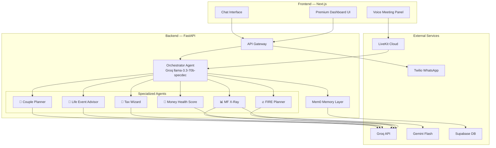

# AI Money Mentor — Prototype Implementation Plan

Build a multi-agent AI-powered personal finance mentor with voice meetings, WhatsApp alerts, and premium UI — fully free LLM stack.

## User Review Required

> [!IMPORTANT]
> **API Keys Needed Before Starting:**
> - **Groq API Key** (free) → [console.groq.com](https://console.groq.com)
> - **Google AI Studio Key** (free) → for Gemini Flash (PDF parsing)
> - **Supabase Project** (free) → [database.new](https://database.new)
> - **LiveKit Cloud** (free tier) → [livekit.io](https://livekit.io)
> - **Twilio Account** (free sandbox) → [twilio.com](https://www.twilio.com) (WhatsApp sandbox)

> [!WARNING]
> **Scope Decision:** This is a hackathon prototype. I will build ALL 6 features (FIRE Planner, Money Health Score, Life Event Advisor, Tax Wizard, Couple's Planner, MF X-Ray) but with mock data for AA/CAMS and focused depth on the demo flow: *"I got a ₹2L bonus, what should I do?"*

> [!CAUTION]
> **Time Estimate:** This is a large build (~40+ files). Estimated implementation time: 4-6 hours of focused coding. Should I reduce scope for faster delivery?

---

## Architecture Overview



---

## Project Structure

```
EtGenAI/
├── frontend/                    # Next.js App
│   ├── src/
│   │   ├── app/
│   │   │   ├── layout.tsx
│   │   │   ├── page.tsx              # Landing / Dashboard
│   │   │   ├── globals.css
│   │   │   ├── dashboard/
│   │   │   │   └── page.tsx          # Main dashboard
│   │   │   ├── mentor/
│   │   │   │   └── page.tsx          # Voice meeting page
│   │   │   ├── health-score/
│   │   │   │   └── page.tsx          # Money Health Score
│   │   │   ├── fire-planner/
│   │   │   │   └── page.tsx          # FIRE Path Planner
│   │   │   ├── tax-wizard/
│   │   │   │   └── page.tsx          # Tax Wizard
│   │   │   └── api/
│   │   │       └── livekit-token/
│   │   │           └── route.ts      # LiveKit token generation
│   │   ├── components/
│   │   │   ├── layout/
│   │   │   │   ├── Sidebar.tsx
│   │   │   │   ├── TopBar.tsx
│   │   │   │   └── AppShell.tsx
│   │   │   ├── dashboard/
│   │   │   │   ├── MoneyHealthCard.tsx
│   │   │   │   ├── NetWorthChart.tsx
│   │   │   │   ├── GoalTracker.tsx
│   │   │   │   └── QuickActions.tsx
│   │   │   ├── chat/
│   │   │   │   ├── ChatPanel.tsx
│   │   │   │   └── MessageBubble.tsx
│   │   │   ├── mentor/
│   │   │   │   ├── VoiceMeeting.tsx
│   │   │   │   ├── VoiceOrb.tsx
│   │   │   │   └── TranscriptPanel.tsx
│   │   │   ├── health-score/
│   │   │   │   ├── ScoreRing.tsx
│   │   │   │   ├── DimensionCard.tsx
│   │   │   │   └── OnboardingFlow.tsx
│   │   │   ├── fire/
│   │   │   │   ├── FireForm.tsx
│   │   │   │   ├── RoadmapTimeline.tsx
│   │   │   │   └── AllocationChart.tsx
│   │   │   └── shared/
│   │   │       ├── GlassCard.tsx
│   │   │       ├── AnimatedNumber.tsx
│   │   │       └── GradientButton.tsx
│   │   ├── lib/
│   │   │   ├── api.ts               # Backend API client
│   │   │   ├── supabase.ts          # Supabase client
│   │   │   └── livekit.ts           # LiveKit helpers
│   │   └── hooks/
│   │       ├── useChat.ts
│   │       └── useVoice.ts
│   ├── public/
│   ├── package.json
│   ├── next.config.js
│   └── tsconfig.json
│
├── backend/                     # FastAPI + LangGraph
│   ├── main.py                  # FastAPI app entry
│   ├── requirements.txt
│   ├── .env.example
│   ├── config.py                # Settings & env vars
│   ├── agents/
│   │   ├── __init__.py
│   │   ├── orchestrator.py      # Main orchestrator (LangGraph)
│   │   ├── fire_planner.py      # FIRE agent
│   │   ├── money_health.py      # Money Health Score agent
│   │   ├── mf_xray.py           # MF Portfolio X-Ray agent
│   │   ├── tax_wizard.py        # Tax Wizard agent
│   │   ├── life_event.py        # Life Event Advisor agent
│   │   ├── couple_planner.py    # Couple's Money Planner agent
│   │   └── tools/
│   │       ├── __init__.py
│   │       ├── sip_calculator.py
│   │       ├── tax_calculator.py
│   │       ├── fire_calculator.py
│   │       └── portfolio_analyzer.py
│   ├── memory/
│   │   ├── __init__.py
│   │   └── mem0_layer.py        # Mem0 memory integration
│   ├── data/
│   │   ├── mock_aa_data.json    # Mock Account Aggregator data
│   │   ├── mock_cams.json       # Mock CAMS statement
│   │   └── mock_user.json       # Mock user profile
│   ├── routers/
│   │   ├── __init__.py
│   │   ├── chat.py              # Chat endpoints
│   │   ├── agents.py            # Agent-specific endpoints
│   │   ├── whatsapp.py          # Twilio WhatsApp webhook
│   │   └── voice.py             # Voice/LiveKit endpoints
│   ├── models/
│   │   ├── __init__.py
│   │   ├── user.py
│   │   ├── financial.py
│   │   └── agent_response.py
│   └── services/
│       ├── __init__.py
│       ├── groq_client.py       # Groq API wrapper
│       ├── gemini_client.py     # Gemini Flash wrapper
│       └── whatsapp_service.py  # Twilio WhatsApp service
│
└── README.md
```

---

## Proposed Changes

### Phase 1: Project Scaffolding & Configuration

#### [NEW] Frontend — Next.js App
- Initialize Next.js with TypeScript, App Router, vanilla CSS
- Install dependencies: `@livekit/components-react`, `@supabase/supabase-js`, `recharts`, `framer-motion`
- Configure environment variables

#### [NEW] Backend — FastAPI App
- Create FastAPI project with proper structure
- Install: `fastapi`, `uvicorn`, `langgraph`, `langchain-groq`, `mem0ai`, `twilio`, `python-dotenv`
- Configure Groq, Gemini, Supabase, Twilio credentials

---

### Phase 2: Backend — Multi-Agent System (Core)

#### [NEW] [config.py](file:///d:/6th Sem/Hackathon/EtGenAI/backend/config.py)
- Pydantic settings for all API keys and configuration
- Model routing table (which LLM for which agent)

#### [NEW] [orchestrator.py](file:///d:/6th Sem/Hackathon/EtGenAI/backend/agents/orchestrator.py)
- LangGraph StateGraph with supervisor pattern
- Groq `llama-3.3-70b-specdec` as router
- Routes to 6 specialized agents based on user intent
- Integrates Mem0 for context retrieval before routing

#### [NEW] [fire_planner.py](file:///d:/6th Sem/Hackathon/EtGenAI/backend/agents/fire_planner.py)
- FIRE path calculation agent
- Tools: SIP calculator, compound interest, asset allocation optimizer
- Generates month-by-month financial roadmap

#### [NEW] [money_health.py](file:///d:/6th Sem/Hackathon/EtGenAI/backend/agents/money_health.py)
- 6-dimension scoring: emergency, insurance, diversification, debt, tax, retirement
- Weighted score calculation with AI-generated recommendations

#### [NEW] [tax_wizard.py](file:///d:/6th Sem/Hackathon/EtGenAI/backend/agents/tax_wizard.py)
- Old vs New regime comparison
- Section 80C, 80D, HRA, NPS deduction identification
- Tax-saving investment recommendations

#### [NEW] [life_event.py](file:///d:/6th Sem/Hackathon/EtGenAI/backend/agents/life_event.py)
- Handles: bonus, marriage, new baby, inheritance, job change
- Customized to tax bracket + risk profile
- **This is the star demo agent**

#### [NEW] [mf_xray.py](file:///d:/6th Sem/Hackathon/EtGenAI/backend/agents/mf_xray.py)
- Portfolio reconstruction from mock CAMS data
- Overlap analysis, expense ratio, XIRR calculation
- Uses Gemini Flash for PDF parsing (mock)

#### [NEW] [couple_planner.py](file:///d:/6th Sem/Hackathon/EtGenAI/backend/agents/couple_planner.py)
- Joint optimization: HRA claims, NPS matching, SIP splits
- Combined net worth tracking

#### [NEW] Agent Tools (`backend/agents/tools/`)
- `sip_calculator.py` — SIP amount, future value, step-up SIP
- `tax_calculator.py` — Old/New regime, deductions, net tax
- `fire_calculator.py` — FIRE number, coastFIRE, leanFIRE
- `portfolio_analyzer.py` — XIRR, overlap, allocation analysis

---

### Phase 3: Backend — Memory & Data Layer

#### [NEW] [mem0_layer.py](file:///d:/6th Sem/Hackathon/EtGenAI/backend/memory/mem0_layer.py)
- Mem0 initialization with Groq as LLM backend
- `add_memory()`, `search_memory()`, `get_all()` for user context
- Scoped by user_id for multi-user support

#### [NEW] Mock Data Files (`backend/data/`)
- `mock_aa_data.json` — Simulated bank statements, FD, MF holdings
- `mock_cams.json` — Simulated CAMS consolidated statement
- `mock_user.json` — Pre-built user profiles for demo

---

### Phase 4: Backend — API Routes

#### [NEW] [chat.py](file:///d:/6th Sem/Hackathon/EtGenAI/backend/routers/chat.py)
- `POST /api/chat` — Main chat endpoint, streams responses
- Passes to orchestrator with user memory context

#### [NEW] [agents.py](file:///d:/6th Sem/Hackathon/EtGenAI/backend/routers/agents.py)
- `POST /api/agents/fire` — Direct FIRE planner
- `POST /api/agents/health-score` — Money Health Score
- `POST /api/agents/tax-wizard` — Tax analysis
- `POST /api/agents/life-event` — Life event advisor
- `GET /api/agents/portfolio` — MF X-Ray

#### [NEW] [whatsapp.py](file:///d:/6th Sem/Hackathon/EtGenAI/backend/routers/whatsapp.py)
- `POST /api/whatsapp/webhook` — Twilio incoming message webhook
- `POST /api/whatsapp/send` — Send alert/summary to user

#### [NEW] [voice.py](file:///d:/6th Sem/Hackathon/EtGenAI/backend/routers/voice.py)
- `POST /api/voice/session` — Create voice session
- WebSocket endpoint for real-time voice ↔ agent communication

---

### Phase 5: Frontend — Premium UI

#### [NEW] Design System (`globals.css`)
- Dark mode with deep navy/charcoal palette
- Glassmorphism cards with `backdrop-filter: blur()`
- Gradient accents: cyan → violet → pink
- Google Fonts: Inter (body) + Space Grotesk (headings)
- Smooth micro-animations and transitions
- CSS custom properties for full theming

#### [NEW] Layout Components
- **Sidebar** — Glassmorphic nav with animated active indicators, agent icons
- **TopBar** — User profile, notification bell, Money Health Score badge
- **AppShell** — Responsive layout wrapper

#### [NEW] Dashboard Page
- **MoneyHealthCard** — Animated ring score (0-100) with 6 dimension breakdown
- **NetWorthChart** — Recharts area chart with gradient fill
- **GoalTracker** — Visual progress bars for each financial goal
- **QuickActions** — Gradient CTAs for common actions

#### [NEW] Chat Interface
- **ChatPanel** — Sliding panel with glassmorphic message bubbles
- AI responses include rich cards (charts, tables, action buttons)
- Typing indicator with pulsing gradient dots

#### [NEW] Voice Meeting Page (`/mentor`)
- **VoiceOrb** — Animated pulsing orb (like Siri) that reacts to audio levels
- **TranscriptPanel** — Real-time transcript with speaker identification
- **VoiceMeeting** — LiveKit room connection, STT/TTS pipeline display
- UI auto-control: agent responses trigger UI navigation (the "wow" factor)

#### [NEW] Health Score Page (`/health-score`)
- 5-minute onboarding wizard flow
- Animated score reveal with confetti
- 6-dimension radar chart

#### [NEW] FIRE Planner Page (`/fire-planner`)
- Input form with sliders for age, income, expenses
- Timeline visualization with milestones
- Asset allocation donut chart

#### [NEW] Tax Wizard Page (`/tax-wizard`)
- Salary structure input / Form 16 upload
- Side-by-side regime comparison
- Savings identification cards with animation

---

### Phase 6: Voice AI Meeting Integration

#### [NEW] LiveKit Integration
- Frontend: `@livekit/components-react` for room joining
- Backend: LiveKit Python agent that joins the same room
- Pipeline: `Mic → Groq Whisper (STT) → Orchestrator → TTS → Speaker`
- **Key Feature:** Agent can send UI commands via LiveKit data messages
  - e.g., `{ "action": "navigate", "page": "/fire-planner", "data": {...} }`
  - Frontend listens for data messages and auto-navigates

---

### Phase 7: WhatsApp Integration

#### [NEW] Twilio WhatsApp
- Sandbox setup for demo
- Incoming message → Orchestrator → Response
- Proactive alerts: SIP due dates, market insights, goal progress
- Summary messages after voice meetings

---

## LLM Routing Table

| Agent | Model | API | Rationale |
|-------|-------|-----|-----------|
| Orchestrator | `llama-3.3-70b-specdec` | Groq | Ultra-fast routing, tool calling |
| FIRE Planner | `llama-3.3-70b-versatile` | Groq | Complex financial reasoning |
| Money Health | `llama-3.1-8b-instant` | Groq | Fast scoring, simple logic |
| Tax Wizard | `llama-3.3-70b-versatile` | Groq | Tax law reasoning |
| Life Event | `llama-3.3-70b-versatile` | Groq | Nuanced advice |
| MF X-Ray | `gemini-2.0-flash` | Google | PDF/document parsing |
| Couple Planner | `llama-3.3-70b-versatile` | Groq | Dual optimization |
| WhatsApp Bot | `llama-3.1-8b-instant` | Groq | Quick responses |

---

## Open Questions

> [!IMPORTANT]
> 1. **Do you have all the API keys ready?** (Groq, Google AI, Supabase, LiveKit, Twilio) — I can proceed with mock/placeholder keys but the demo won't work end-to-end without them.

> [!IMPORTANT]
> 2. **Scope priority:** Should I build everything or focus on the killer demo flow first? My recommendation:
>    - **Phase A (Must-have for demo):** Dashboard + Chat + Life Event Agent + Voice Meeting + WhatsApp summary
>    - **Phase B (Nice-to-have):** FIRE Planner + Money Health Score + Tax Wizard full pages
>    - **Phase C (Bonus):** MF X-Ray + Couple's Planner

> [!WARNING]
> 3. **LiveKit vs Simulated Voice:** LiveKit requires a cloud account and a Python agent server. For hackathon simplicity, I could simulate the voice meeting with browser Web Audio API + Groq Whisper API directly from the frontend. Which do you prefer?
>    - **Option A:** Full LiveKit (more impressive, more setup)
>    - **Option B:** Browser-native voice (simpler, still looks great)

> [!IMPORTANT]
> 4. **Deployment plan:** Will you deploy to Vercel (frontend) + Render/Railway (backend)? Or run everything locally for the demo?

---

## Verification Plan

### Automated Tests
```bash
# Backend
cd backend && python -m pytest tests/ -v

# Frontend
cd frontend && npm run build   # Verify no build errors
```

### Manual Verification
1. **Chat Flow:** Send "I got a ₹2L bonus" → Verify orchestrator routes to Life Event agent → Verify response includes tax breakdown + SIP allocation
2. **Voice Meeting:** Join voice room → Speak query → Verify STT transcription → Verify AI response audio playback → Verify UI auto-navigation
3. **WhatsApp:** Send message to Twilio sandbox → Verify response → Verify summary delivery
4. **Dashboard:** Verify all charts render, animations work, responsive on mobile
5. **Health Score:** Complete onboarding → Verify score calculation across 6 dimensions

### Demo Flow Verification
Run the exact 60-second demo flow end-to-end:
> User joins voice meeting → Says "I got a ₹2 lakh bonus" → AI responds → UI auto-opens Life Event Advisor → Shows tax breakdown + SIP allocation → WhatsApp summary sent
