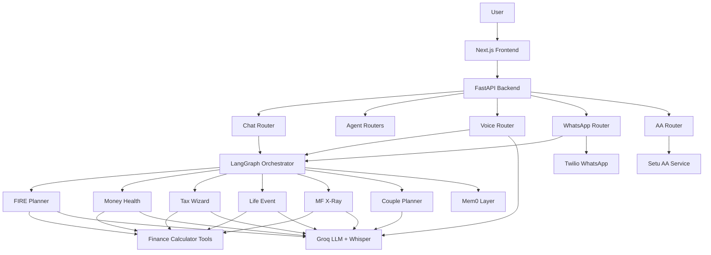

# AI Money Mentor - Architecture and Build Status

This document is the current source of truth for the project architecture, the technologies used, what has been implemented, and what is still partial or demo-only.

## Project Summary

AI Money Mentor is a multi-agent personal finance assistant built for the ET GenAI Hackathon 2026. It combines:

- a Next.js frontend for dashboard, planners, chat, and voice meeting UI
- a FastAPI backend for chat, agent orchestration, voice processing, WhatsApp, and Account Aggregator endpoints
- LLM-driven agent routing and response generation
- finance-specific calculator utilities for FIRE, SIP, tax, and portfolio logic
- memory and external integration scaffolding for Mem0, Twilio, and Setu AA

The current codebase is a working prototype, not a fully production-ready personal finance platform.

## High-Level Architecture



## Tech Stack

### Frontend

- Next.js 16.2.1
- React 19.2.4
- TypeScript 5
- Vanilla CSS in App Router
- Framer Motion
- Recharts
- LiveKit packages installed in `package.json`

### Backend

- FastAPI
- Uvicorn
- LangGraph
- LangChain Groq
- LangChain Core
- Pydantic v2
- Pydantic Settings
- HTTPX
- Python Multipart
- WebSockets
- NumPy
- SciPy

### AI and Integrations

- Groq LLM inference
- Groq Whisper transcription
- Mem0 memory integration with fallback
- Twilio WhatsApp integration
- Setu Account Aggregator sandbox integration
- Google Gemini dependency/config present, but not actively wired into runtime flows
- Supabase config present, but not actively wired into runtime flows

## Current Model Configuration

Configured in `backend/config.py`:

- `orchestrator_model`: `openai/gpt-oss-120b`
- `agent_model`: `llama-3.3-70b-versatile`
- `fast_model`: `llama-3.1-8b-instant`
- `gemini_model`: `gemini-3.1-flash-lite-preview`

Important note:

- the orchestrator currently routes with the configured Groq client
- Gemini is configured as an environment setting, but there is no dedicated runtime Gemini service in the current repo

## Repository Structure

```text
EtGenAI/
├── backend/
│   ├── agents/
│   │   ├── orchestrator.py
│   │   ├── fire_planner.py
│   │   ├── money_health.py
│   │   ├── tax_wizard.py
│   │   ├── life_event.py
│   │   ├── mf_xray.py
│   │   ├── couple_planner.py
│   │   └── tools/
│   │       ├── sip_calculator.py
│   │       ├── tax_calculator.py
│   │       ├── fire_calculator.py
│   │       └── portfolio_analyzer.py
│   ├── data/
│   │   └── mock_data.py
│   ├── memory/
│   │   └── mem0_layer.py
│   ├── models/
│   │   ├── user.py
│   │   ├── financial.py
│   │   └── agent_response.py
│   ├── routers/
│   │   ├── chat.py
│   │   ├── agents.py
│   │   ├── voice.py
│   │   ├── whatsapp.py
│   │   └── aa.py
│   ├── services/
│   │   └── setu_aa.py
│   ├── config.py
│   ├── main.py
│   └── requirements.txt
├── frontend/
│   ├── src/
│   │   ├── app/
│   │   │   ├── page.tsx
│   │   │   ├── mentor/page.tsx
│   │   │   ├── health-score/page.tsx
│   │   │   ├── fire-planner/page.tsx
│   │   │   ├── tax-wizard/page.tsx
│   │   │   ├── mf-xray/page.tsx
│   │   │   ├── life-events/page.tsx
│   │   │   └── couple-planner/page.tsx
│   │   ├── components/
│   │   │   ├── Sidebar.tsx
│   │   │   ├── TopBar.tsx
│   │   │   └── ChatPanel.tsx
│   │   └── lib/
│   │       └── api.ts
│   ├── package.json
│   └── next.config.ts
├── README.md
├── implementation_plan.md
└── walkthrough.md
```

## Backend Architecture

### 1. Application Entry

`backend/main.py` creates the FastAPI app, registers CORS, and mounts the API routers.

Mounted routers:

- `/api` -> chat router
- `/api/agents` -> direct agent router
- `/api/voice` -> voice routes
- `/api/whatsapp` -> WhatsApp routes
- `/api/aa` -> Account Aggregator routes

### 2. Config and Environment

`backend/config.py` currently contains settings for:

- Groq
- Google AI
- Supabase
- Twilio
- Setu AA
- model routing
- frontend URL

Environment usage today:

- Groq: actively used
- Twilio: integrated in router
- Setu AA: integrated in router/service
- Google AI: configured but not actively used in the current request flow
- Supabase: configured but not actively used in the current request flow

### 3. Chat and Orchestration Layer

`backend/routers/chat.py` exposes:

- `POST /api/chat`
- `GET /api/user/profile`
- `GET /api/user/memories`

`backend/agents/orchestrator.py` uses LangGraph to:

- retrieve memory context
- route the user message to the best matching specialist agent
- execute the selected agent
- store lightweight memory after the response

Specialist agents:

- FIRE Planner
- Money Health Score
- Tax Wizard
- Life Event Advisor
- MF X-Ray
- Couple Planner

### 4. Finance Agent Layer

Each agent combines:

- mock user data or provided context
- calculator outputs from the tools layer
- an LLM-generated response
- optional structured UI action metadata

Current agent responsibilities:

- `fire_planner.py`: FIRE number, savings rate, milestones, SIP planning
- `money_health.py`: six-dimension financial health scoring
- `tax_wizard.py`: old vs new regime comparison and missed deductions
- `life_event.py`: bonus, marriage, baby, inheritance, job change handling
- `mf_xray.py`: portfolio overlap, allocation, expense ratio drag
- `couple_planner.py`: combined income/investment planning for partners

### 5. Finance Tools Layer

`backend/agents/tools/` contains reusable calculators:

- `sip_calculator.py`
  - SIP future value
  - required SIP
  - step-up SIP
  - goal SIP planning
- `tax_calculator.py`
  - old/new regime calculations
  - deduction handling
  - missed deduction detection
- `fire_calculator.py`
  - FIRE number
  - lean FIRE
  - fat FIRE
  - coast FIRE
  - years to FIRE
- `portfolio_analyzer.py`
  - XIRR function
  - overlap analysis
  - expense ratio drag
  - allocation analysis

### 6. Voice Layer

`backend/routers/voice.py` provides:

- audio transcription endpoint
- voice processing endpoint
- websocket endpoint for voice interaction

Current voice stack:

- audio captured in browser
- audio sent to backend
- Groq Whisper used for transcription
- orchestrator used for response generation
- browser TTS used on frontend for playback

### 7. WhatsApp Layer

`backend/routers/whatsapp.py` provides:

- Twilio webhook handling
- send message endpoint
- send summary endpoint

Purpose:

- receive incoming WhatsApp messages
- process them through the orchestrator
- send back summary or reply text

### 8. Account Aggregator Layer

`backend/routers/aa.py` and `backend/services/setu_aa.py` add Setu AA sandbox support.

Available AA endpoints:

- `POST /api/aa/consent`
- `GET /api/aa/consent/{consent_id}`
- `POST /api/aa/session/{consent_id}`
- `GET /api/aa/data/{session_id}`
- `POST /api/aa/demo-flow`
- `GET /api/aa/mock-data`

Setu service responsibilities:

- create consent
- check consent status
- create data session
- fetch AA data
- normalize raw Setu data into internal structures

Normalized output sections:

- accounts
- deposits
- mutual funds
- equities

Important implementation note:

- the AA integration exists on the backend
- it is not yet fully connected into the frontend planner flow or the agent personalization flow
- mock AA data is still used as the main fallback/demo data source

### 9. Memory Layer

`backend/memory/mem0_layer.py` provides:

- `add_memory`
- `search_memory`
- `get_all_memories`

Behavior:

- tries Mem0 first
- falls back to an in-memory Python store if Mem0 initialization or calls fail

Important limitation:

- fallback memory is not persistent across server restarts

### 10. Data Layer

`backend/data/mock_data.py` provides demo datasets for:

- user profile
- AA-style account and transaction data
- CAMS-like mutual fund data

This is still an important part of the current app flow because several planners and pages rely on mock profile data rather than fully user-provided structured input.

## Frontend Architecture

### 1. Frontend Shell

The frontend is a Next.js App Router app with a single visual system built in `globals.css`.

Shared UI components:

- `Sidebar.tsx`
- `TopBar.tsx`
- `ChatPanel.tsx`

Design direction:

- dark premium UI
- glassmorphism cards
- gradients
- animated stats and rings
- dashboard-style layout

### 2. Pages

Implemented pages:

- `/` -> dashboard
- `/mentor` -> voice meeting
- `/health-score` -> health assessment
- `/fire-planner` -> FIRE planner
- `/tax-wizard` -> tax planner
- `/mf-xray` -> portfolio analysis
- `/life-events` -> event advisor
- `/couple-planner` -> couple planning

### 3. Frontend API Client

`frontend/src/lib/api.ts` currently provides methods for:

- chat
- direct agent calls
- profile fetch
- voice processing
- WhatsApp summary
- websocket URL generation

### 4. Frontend Data Behavior

There are two patterns in the current UI:

- pages that call backend endpoints and render the response
- pages that still contain local mock UI data and fallback logic for demo mode

This means the frontend is visually complete enough for demos, but not every page is yet a fully connected production workflow.

## What Has Been Built

The following are implemented in the codebase today:

- FastAPI application with router-based API structure
- LangGraph orchestrator for agent routing
- six specialized finance agents
- finance calculator utility layer
- chat endpoint and chat UI
- voice page with browser microphone capture and backend transcription flow
- WhatsApp router and Twilio integration scaffolding
- Mem0 integration with in-memory fallback
- Setu AA backend integration and normalization layer
- Next.js frontend with eight finance-focused routes
- glassmorphism-style dashboard UI and reusable layout components

## What Is Partial or Demo-Only

The following exist, but are not fully production-ready:

- direct planner pages still rely heavily on mock profile data on the backend
- dashboard and top bar are largely static presentation data
- WhatsApp flow exists, but should still be treated as integration-stage
- AA integration exists on backend only; it is not fully driving personalized agent behavior yet
- voice websocket exists, but the main frontend flow currently uses request-response voice processing
- Gemini is configured as dependency/settings, but not truly active in the runtime path
- Supabase is configured in settings, but there is no active persistence/data model implementation in this repo

## What Is Not Yet Implemented End-to-End

- full user-specific data persistence in Supabase
- structured user financial onboarding persisted across sessions
- real planner calculations driven by saved user records instead of mock user defaults
- AA-driven personalization flowing automatically into all relevant agents
- full portfolio ingestion from real uploaded statements plus live reconciliation
- production-grade auth, consent storage, audit trail, and background jobs

## External Services Used

### Actively Used

- Groq
  - LLM inference for orchestration and agents
  - Whisper transcription for voice flow
- Twilio
  - WhatsApp webhook and outbound messaging
- Setu AA sandbox
  - AA consent and data session flow on backend
- Mem0
  - memory layer with fallback

### Configured but Not Fully Used

- Google AI / Gemini
- Supabase
- LiveKit packages on frontend

## Current API Surface

### Core

- `GET /api/health`
- `POST /api/chat`
- `GET /api/user/profile`
- `GET /api/user/memories`

### Direct Agents

- `POST /api/agents/fire`
- `POST /api/agents/health-score`
- `POST /api/agents/tax-wizard`
- `POST /api/agents/life-event`
- `POST /api/agents/mf-xray`
- `POST /api/agents/couple-planner`

### Voice

- `POST /api/voice/transcribe`
- `POST /api/voice/process`
- `WS /api/voice/ws`

### WhatsApp

- `POST /api/whatsapp/webhook`
- `POST /api/whatsapp/send`
- `POST /api/whatsapp/send-summary`

### Account Aggregator

- `POST /api/aa/consent`
- `GET /api/aa/consent/{consent_id}`
- `POST /api/aa/session/{consent_id}`
- `GET /api/aa/data/{session_id}`
- `POST /api/aa/demo-flow`
- `GET /api/aa/mock-data`

## Environment and Configuration

Backend environment contains configuration for:

- Groq API key
- Google API key
- Supabase URL and key
- Twilio credentials
- Setu client ID
- Setu client secret
- Setu product instance ID
- model names
- frontend URL

Frontend environment currently uses:

- `NEXT_PUBLIC_API_URL`

## Recommended Positioning of the Project

The most accurate way to describe the current system is:

"A multi-agent AI personal finance prototype with working orchestration, planner logic, voice/chat UX, WhatsApp and Setu AA integration scaffolding, and a strong demo UI."

Avoid describing it as:

- a fully real-data financial copilot
- a fully AA-powered personalization engine
- a fully Supabase-backed persistent platform

Those parts are only partially implemented or not yet connected end to end.

## How to Run

### Backend

```bash
cd backend
python -m venv venv
venv\Scripts\activate
pip install -r requirements.txt
uvicorn main:app --reload --port 8000
```

### Frontend

```bash
cd frontend
npm install
npm run dev
```

Open:

- frontend -> `http://localhost:3000`
- backend health -> `http://localhost:8000/api/health`

## Suggested Demo Flow

1. Open the dashboard and show the planner/navigation surface.
2. Open the mentor page and demonstrate voice capture.
3. Ask a bonus-related question so the orchestrator routes to the Life Event agent.
4. Show the response and the structured allocation output.
5. Show direct planner pages for FIRE, tax, health score, and MF X-Ray.
6. Demonstrate the AA endpoints in backend or via Postman using Setu sandbox or mock AA data.

## Final Status Summary

### Strongest Implemented Areas

- backend routing and agent architecture
- finance calculator utilities
- life event demo flow
- frontend visual experience
- Setu AA backend integration scaffolding

### Biggest Gaps

- real persisted user data model
- end-to-end AA-to-agent personalization
- fully connected planner forms
- production-ready voice and WhatsApp flows
- active Supabase and Gemini usage
